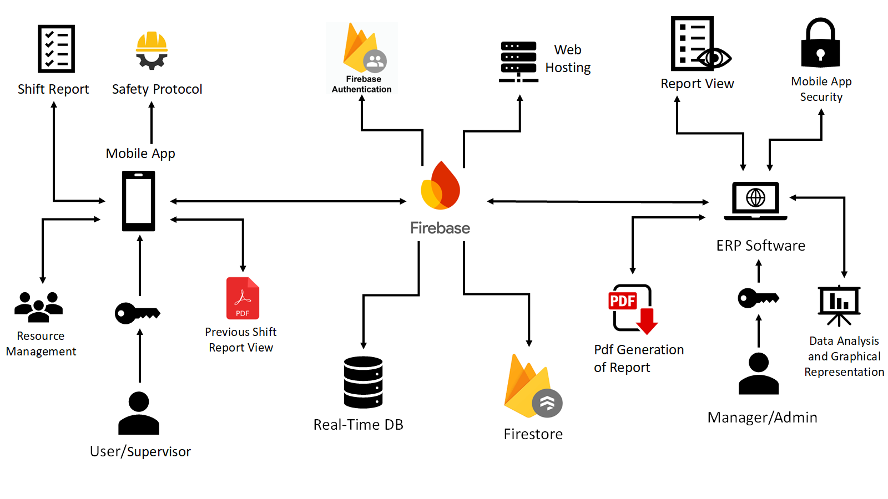
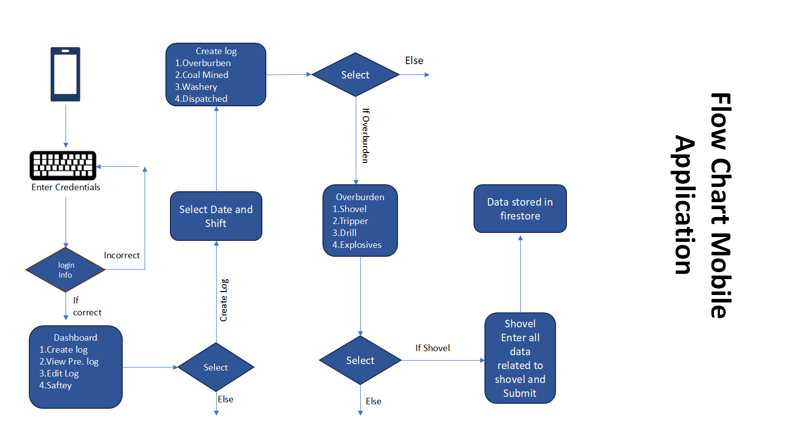
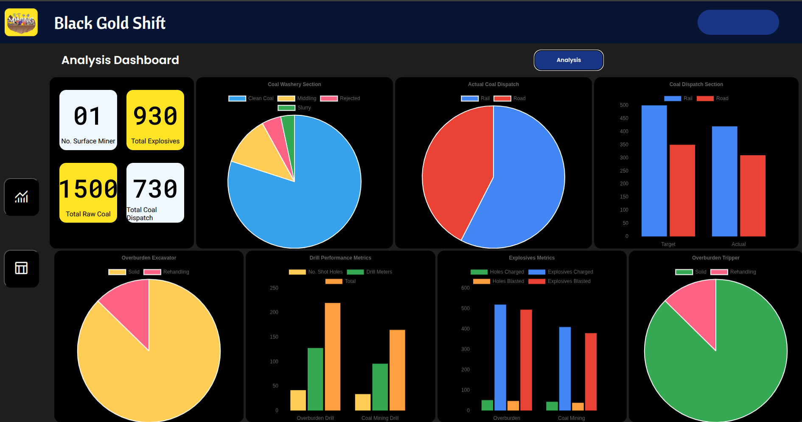
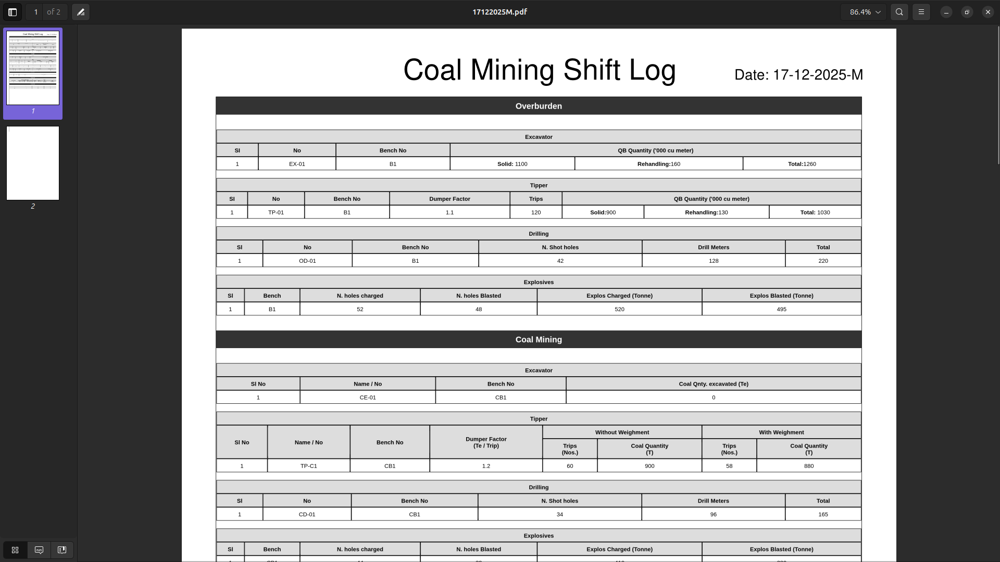
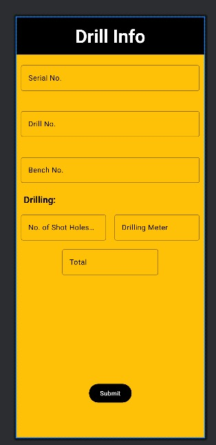

# Black Gold Shift

**Black Gold Shift** is a hackathon project built to digitize daily coal-mining shift logs.
It consists of a **web dashboard** for analysis and reporting, and a **companion Android app** for field data entry.
Both applications use **Firebase** as a shared backend.

This project was originally built during a college hackathon and was recently revived to make it runnable and demo-ready again.

---

## Why this project?

In many mining operations, shift data is still recorded manually on paper.
This project was an attempt to:

* Reduce manual paperwork
* Digitize shift handover logs
* Make reports easier to view, analyze, and export
* Experiment with a simple App + Web + Firebase system

The goal was **not** to build a production-ready ERP, but to solve a real problem at a basic level.

---

## What’s included

### 🌐 Web Application

* Login using Firebase Authentication
* Analysis dashboard with charts
* Shift log table view
* PDF generation of daily shift reports
* Seeder tool to populate demo data

The web app is mainly used by **managers/admins** to:

* View reports
* Analyze production data
* Export shift logs as PDF

---

### 📱 Android Application

* Login screen
* Date & shift selection
* Simple dashboard
* Form-based data entry for:

  * Overburden
  * Coal mining
  * Washery
  * Dispatch
  * Drilling, explosives, surface miners, etc.
* Data is written directly to Firebase Firestore

The Android app is mainly used by **supervisors/operators** to enter shift data from the field.

---

## Tech stack

* **Frontend (Web):** HTML, CSS, JavaScript
* **Charts:** Chart.js
* **PDF:** jsPDF + html2canvas
* **Mobile App:** Android (Java)
* **Backend:** Firebase

  * Firebase Authentication
  * Cloud Firestore
  * Firebase Hosting (for web)

There is **no custom backend server**.

---
## Architecture & Data Flow

This project follows a simple App + Web + Firebase architecture.

**System Architecture**


**Data Flow**


---

## How the system works (high level)

1. User logs in via Web or Android app (Firebase Auth)
2. Android app creates or updates a shift log in Firestore
   (document ID format: `DDMMYYYY + Shift`, e.g. `16122025M`)
3. Web app reads the same Firestore document
4. Data is:

   * Shown in tables
   * Visualized using charts
   * Converted into a downloadable PDF

---

## Project structure (simplified)

```
black-gold-shift/
│
├── web files (HTML / CSS / JS)
├── seed.html               # Demo data seeder
├── android/                # Android app code
├── README.md
└── LICENSE
```

---

## Screenshots


1. **Web Dashboard (Analysis page)**

   * Shows charts and KPI cards
     

2. **Web Shift Log Table view**

   * Shows structured data used for PDF
     

3. **Generated PDF**

   * Confirms export works
     


## Android App (Data Entry)

<p align="center">
  
  
  
</p>

<p align="center">
  <em>Login, shift selection, and daily data entry screens</em>
</p>

---

## Seeder tool (for demo)

The project includes a **seeder page** that inserts demo shift data into Firestore.

Purpose:

* Make the dashboard and PDF work without manual entry
* Useful for demos and testing

This is **not production logic** and is kept intentionally simple.

---

## Known limitations

This is an old hackathon project and is intentionally kept simple.

* UI is **not fully responsive**
* No role-based access control
* Firestore rules are basic
* PDF size can be large (MBs) due to HTML snapshot rendering
* Cloud PDF upload is **disabled**

  * Firebase Storage free tier is no longer available
  * PDFs are downloaded locally instead
* No backend validation or advanced security

These trade-offs were acceptable for a hackathon and learning project.

---

## Team & contributions

This project was built as a **team effort**:

* **Web Dashboard & PDF Generation:**
  Handled by one team member (frontend + Firebase integration)

* **Android Application:**
  Built by **Sujal** (Android app, data entry flows, Firebase writes)

Both applications share the same Firebase backend and data model.

---

## License

MIT — Do what you want with this code.
If you reuse it, a short attribution is appreciated.

See the `LICENSE` file for full details.

---

## Final note

This project reflects our learning stage at the time it was built.
It’s not meant to be perfect or production-ready — it’s a **real hackathon project**, revived and documented honestly.

